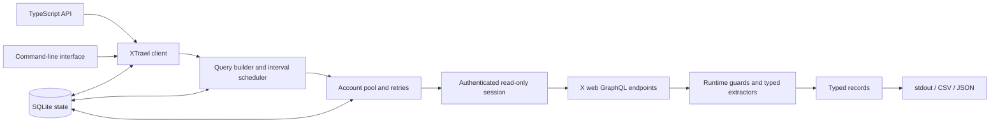

<h1 align="center">XTrawl</h1>

<p align="center">
  Scrape public X posts, profiles, followers, and following.
</p>

XTrawl collects public data from X without an official API key. Search posts, read profiles and
timelines, inspect individual posts, collect follower and following lists, and save results as CSV or
JSON. It splits long searches, rotates authorized accounts when requests fail, and saves resumable
progress in SQLite. Use it from TypeScript or the command line.

## What XTrawl collects

- Search results with date, account, phrase, hashtag, language, location, media, and engagement filters
- Individual posts by ID or status URL
- Public profile details for one or more usernames
- Posts from public profile timelines
- Public followers, following, and verified-follower relationships
- Normalized TypeScript records with optional CSV and JSON output

XTrawl never posts, replies, likes, follows, messages, or changes account settings.

## Quick start

XTrawl requires Node.js 22.5 or newer and npm.

```bash
npm install xtrawl
```

Provide session cookies from an X account you own or are authorized to use. Keep them in environment
variables; never commit them.

```bash
export X_AUTH_TOKEN="your-auth-token"
export X_CSRF_TOKEN="your-ct0-token"
```

Run a search:

```bash
npx xtrawl search "typescript" \
  --since 2026-01-01 \
  --display-type Latest \
  --limit 100 \
  --save \
  --save-format json \
  --pretty
```

`--pretty` prints indented JSON to stdout. With `--save`, XTrawl also writes records to `outputs/`
by default.

## Use the TypeScript API

Import the package from TypeScript or JavaScript:

```ts
import { XTrawl } from "xtrawl";

const client = await XTrawl.create({
  authToken: process.env.X_AUTH_TOKEN,
  csrfToken: process.env.X_CSRF_TOKEN,
  dbPath: "xtrawl.db",
});

try {
  const result = await client.search("typescript", {
    since: "2026-01-01",
    fromUsers: ["OpenAI"],
    minLikes: 10,
    displayType: "Latest",
    limit: 100,
  });

  console.log(result.tweets);
  console.log(result.stats);
} finally {
  client.close();
}
```

Use `XTrawl.create()` for normal startup. If an account has `auth_token` but no `ct0` value, this
factory attempts to bootstrap the missing CSRF cookie before the first request.

## Common tasks

```ts
// Resolve public profiles.
const profiles = await client.getUserInfo(["OpenAI", "github"]);

// Inspect one public post.
const tweet = await client.getTweet("https://x.com/OpenAI/status/1234567890");

// Collect posts from public profile timelines.
const timeline = await client.getProfileTweets(["OpenAI"], {
  perProfileLimit: 100,
  resume: true,
});

// Collect public relationships.
const followers = await client.getFollowers(["OpenAI"], { limit: 500 });
const following = await client.getFollowing(["OpenAI"], { limit: 500 });
const verified = await client.getVerifiedFollowers(["OpenAI"], { limit: 500 });
```

Targets may be usernames, `@user` handles, X or Twitter profile URLs, or typed target objects.
Profile-timeline and relationship methods also accept numeric user IDs and `/i/user/ID` URLs.

## Use the CLI

Global options must appear before the command. Command options come after it.

```bash
# Inspect profiles
npx xtrawl user-info OpenAI github --pretty

# Inspect a post
npx xtrawl tweet 1234567890 --pretty

# Save posts from two profiles as CSV and JSON
npx xtrawl profile-tweets OpenAI github \
  --per-profile-limit 100 \
  --resume \
  --save \
  --save-format both

# Use an account file, a proxy, and a separate state database
npx xtrawl \
  --cookies-file ./accounts.json \
  --proxy http://127.0.0.1:8080 \
  --db-path ./state/xtrawl.db \
  followers OpenAI \
  --limit 500
```

Available commands are `search`, `tweet`, `profile-tweets`, `followers`, `following`,
`verified-followers`, and `user-info`.

## How XTrawl works



For each operation, XTrawl leases an eligible account from SQLite, verifies its proxy when configured,
creates an authenticated session, builds a read-only web request, and paginates until the requested
limit or another stop condition is reached. Searches default to the previous 30 days and divide that
interval into concurrent tasks. Failed requests use bounded backoff, account switching, and session
repair. Responses enter the application as unknown data and are narrowed into typed records at the
engine boundary.

SQLite tracks account health, request usage, leases, run history, resumable cursors, and cached
operation manifests. It does not store collected posts or profiles unless you explicitly enable file
output.

## Accounts and proxies

For one account, pass `X_AUTH_TOKEN` and `X_CSRF_TOKEN` directly. For an account pool, provide a JSON,
Netscape-cookie, or delimited account file with `--cookies-file`, or use the equivalent library
options. A global proxy can be set with `--proxy`; library account records may also define their own
HTTP, HTTPS, or SOCKS5 proxy.

XTrawl selects only accounts that have usable authentication, are outside cooldown, are not already
leased, and remain within configured daily limits. Rate-limit and transient failures trigger a
cooldown and can switch the current task to another account. Authentication failures attempt a CSRF
cookie repair before the account remains unusable.

## Resume and save output

Set `resume: true` or pass `--resume` to persist pagination cursors. XTrawl clears a checkpoint after
that operation finishes successfully and retains it when a run is interrupted.

Set `save: true` or pass `--save` to write records. Supported formats are `csv`, `json`, and `both`.
The default output directory is `outputs/`; use `saveDir` or `--save-dir` to change it. Repeated saves
append records, and generated filenames include the query/date range or collection targets.

## Manage local state

The library exposes safe account and run maintenance through `client.db`. It can list redacted
accounts, import accounts, assign proxies, repair or disable an account, clear expired leases and
checkpoints, reset local counters, inspect run history, and remove a named account. Destructive
duplicate cleanup is a dry run unless explicitly enabled.

## Safety and limitations

- Collect only public data with accounts you own or are authorized to use.
- Keep cookies, tokens, databases, and output files out of version control and secret-sharing paths.
- XTrawl cannot access private or protected content that the active session cannot already view.
- X's undocumented web endpoints and operation identifiers can change without notice.
- Session cookies expire, and account availability or platform rate limits can interrupt a run.
- Conservative local limits reduce pressure on accounts but do not guarantee uninterrupted access.
- You are responsible for following platform terms and applicable privacy, data, and automation laws.

## Documentation

- [Complete usage and API guide](DOCUMENTATION.md)
- [Product specification](docs/product/specification.md)
- [Architecture overview](docs/architecture/overview.md)
- [Security and data boundary](docs/security/data-boundary.md)
- [Architecture decisions](docs/decisions/)

## Development

Run the fast local checks while working:

```bash
npm run check
```

Run the complete delivery gate before publishing a change:

```bash
npm run verify
```

The full gate checks formatting, linting, strict TypeScript compilation, unit tests, package and CLI
smoke behavior, harness integrity, and context-budget limits. Live integration tests require
caller-supplied credentials and are disabled unless explicitly enabled.
